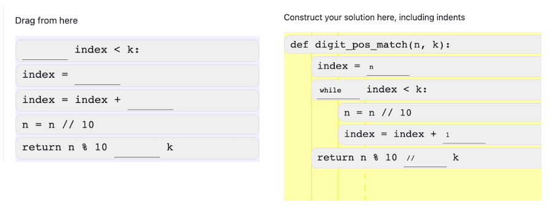

 

   
<b>`Parson Puzzles Maker`[`Click Here`](https://parsons.problemsolving.io/){:target="_blank"}</b>
   

### Solve the Puzzles

1. <b>`Sovle the puzzle to print "Hello World"` [`Click Here`](https://parsons.problemsolving.io/puzzle/4fdc6f83f1754ed6a4f1ed7b0e3ada0a){:target="_blank"} </b>
   
2. <b>`Solve the puzzle to print an Integer from user` [`Click Here`](https://parsons.problemsolving.io/puzzle/f472db8f155e4ff9b119035769772d92){:target="_blank"}</b>
   
3. <b>`Solve the puzzle to add two numbers from user` [`Click Here`](https://parsons.problemsolving.io/puzzle/2c1013d844fd44bf96c7489ad334da28){:target="_blank"}</b>
   
4. <b>`Solve the puzzle to swap numbers using temporary variable` [`Click Here`](https://parsons.problemsolving.io/puzzle/5c9e1333b22a4aeaa900726a19a56355){:target="_blank"}</b>
